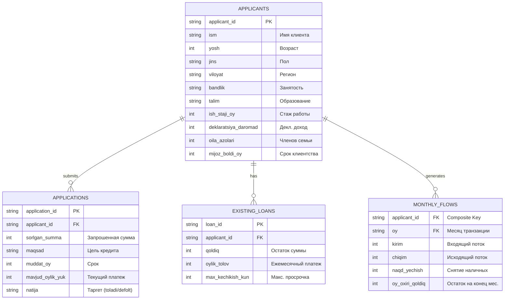

# Схема данных (ERD) — CBU Coding Hackathon 2026

Данная схема описывает структуру данных, используемых в модуле скоринга на этапе MVP (считывание из CSV файлов). В будущем эти сущности мигрируют в реляционную PostgreSQL базу.

## Пояснения к модели
- **APPLICANTS** — базовая таблица профилей клиентов.
- **APPLICATIONS** — таблица заявок, содержащая параметры запроса и целевую переменную `natija` (Target), которая отсутствует в скрытом тестовом датасете 2-го дня.
- **EXISTING_LOANS** — кредитная история клиента (Кредитный регистр), где аккумулируются открытые займы. Из них мы высчитываем долговую нагрузку и дисциплину платежей.
- **MONTHLY_FLOWS** — выписки по счету клиента за последние 12 месяцев. Используется для расчета стабильности (Coefficient of Variance) и реального медианного дохода.
