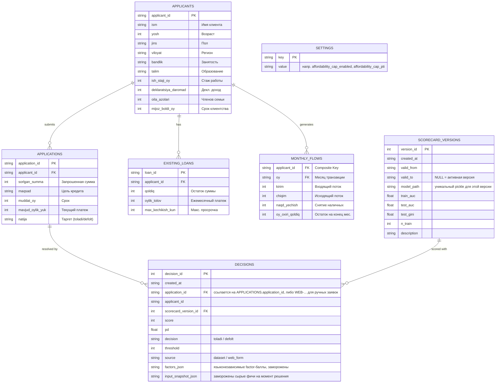

# Схема данных (ERD) — CBU Coding Hackathon 2026

Источник данных (CSV) и слой персистентности (SQLite, `db.py`) — два разных набора таблиц:

- **APPLICANTS / APPLICATIONS / EXISTING_LOANS / MONTHLY_FLOWS** — считываются из предоставленных CSV (`data_loader.py`), только на чтение.
- **SCORECARD_VERSIONS / DECISIONS** — реально персистентны в `credit_scoring.db` (SQLite), пишутся приложением. Это и есть immutable decision log + SCD Type 2 версионирование scorecard из базового требования ТЗ.
- **SETTINGS** — key/value, рантайм-конфигурация (не из ТЗ) — сейчас единственное применение: включение/значение affordability-потолка для `find_max_limit()`, редактируется на `/model-info`.

## Пояснения к модели
- **APPLICANTS** — базовая таблица профилей клиентов.
- **APPLICATIONS** — таблица заявок, содержащая параметры запроса и целевую переменную `natija` (Target), которая отсутствует в скрытом тестовом датасете 2-го дня.
- **EXISTING_LOANS** — кредитная история клиента (Кредитный регистр), где аккумулируются открытые займы. Из них мы высчитываем долговую нагрузку и дисциплину платежей.
- **MONTHLY_FLOWS** — выписки по счету клиента за последние 12 месяцев. Используется для расчета стабильности (Coefficient of Variance) и реального медианного дохода.
- **SCORECARD_VERSIONS** — SCD Type 2. При каждом обучении (`scoring_engine.py: train_publish_and_seed`) закрывается текущая активная версия (`valid_to = now`) и вставляется новая — никогда не UPDATE на месте.
- **DECISIONS** — append-only immutable log. При сборке образа заносится решение по каждой из 2700 заявок датасета; заявки через `/apply` логируются отдельно (`source="web_form"`). Хранится замороженный языконезависимый снимок (feature-ключи, баллы, направление), человекочитаемый текст (`reason`, названия факторов) генерируется заново в языке текущей сессии при просмотре — сам факт решения от языка интерфейса не зависит.
- **SETTINGS** — не связана FK ни с чем, простое key/value-хранилище рантайм-настроек. Единственное текущее применение — affordability-потолок PTI для `find_max_limit()` (см. DECISIONS.md, п.5): выключен по умолчанию, включается и настраивается формой на `/model-info` без пересборки образа.
